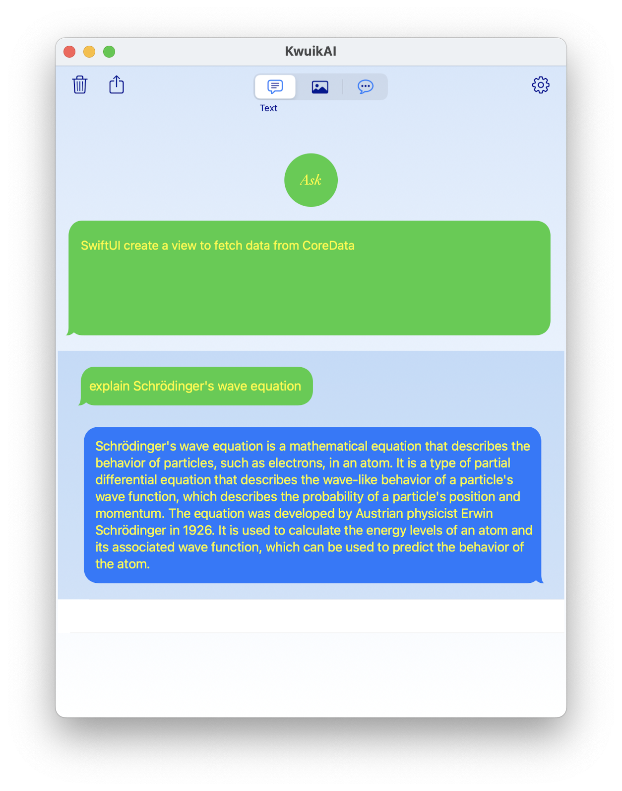
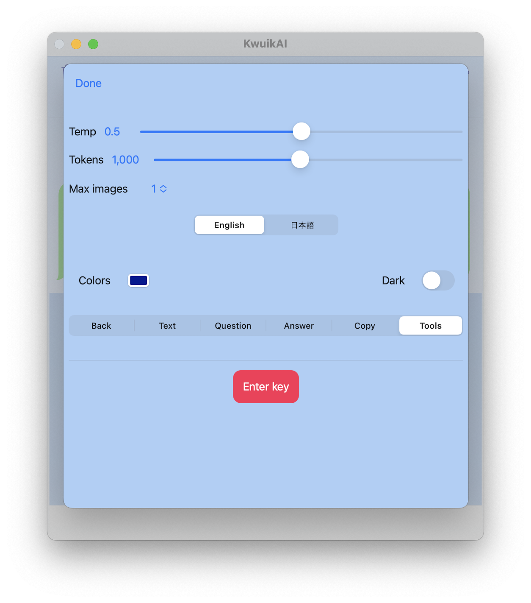

# SwiftUI OpenAI demo App

A chat-like SwiftUI OpenAI demo App, includes text and image output.

Using, the `OpenAI API Client Library in Swift`  [OpenAISwift](https://github.com/Swift-Almanac/OpenAISwift), 
`a community-maintained library to access OpenAI HTTP API's.`

  
    

### Usage

-   **Tap** on a question or answer, to **copy** it to the `Pasteboard` and enable you to paste it elsewhere.
  
-   **Swipe left** on a question/answer, to deleted it.
  
-   **Tap** on the `trash can`, to delete **all** questions and answers. 

-   **Tap** on the `share`, to share the previously tapped answer. 

-   **Pick** the AI answer type, `Text`, `Image` or `Chat`.

To generate code, for example `Swift` code, ask something like, **SwiftUI create a view to fetch data from CoreData**, or **write code in Swift to ...**

#### Settings

Press the **gear shape** icon to:

-   enter the **required** OpenAI api key,
-   select the OpenAI model parameters,
-   select the UI colors,
-   select the UI language
  
### References

-    [OpenAI API Client Library in Swift](https://github.com/Swift-Almanac/OpenAISwift)
-    Various code snippets from [stackoverflow](https://stackoverflow.com)
-    ChatBubble View from [ChatBubble](https://medium.com/devtechie/chat-bubble-custom-shape-in-swiftui-1f618cd94f3c)

### Requirement

**Requires** a valid OpenAI key, see:

-    [OpenAI](https://openai.com/)

Copy and paste the key into the **Settings** ("gear shape") and save it in the `Enter key` area.

### License

The MIT License (MIT)
